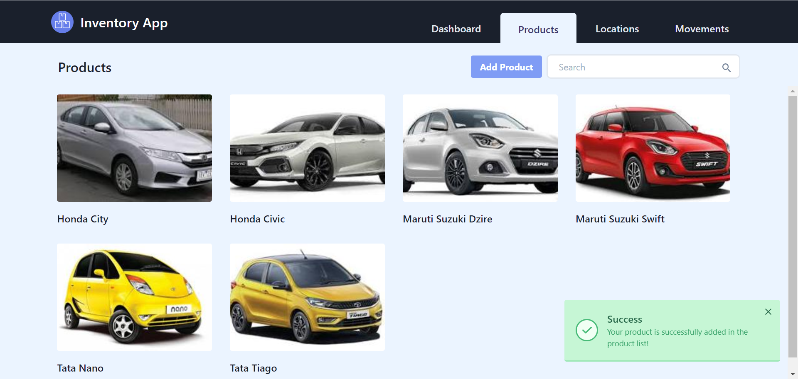
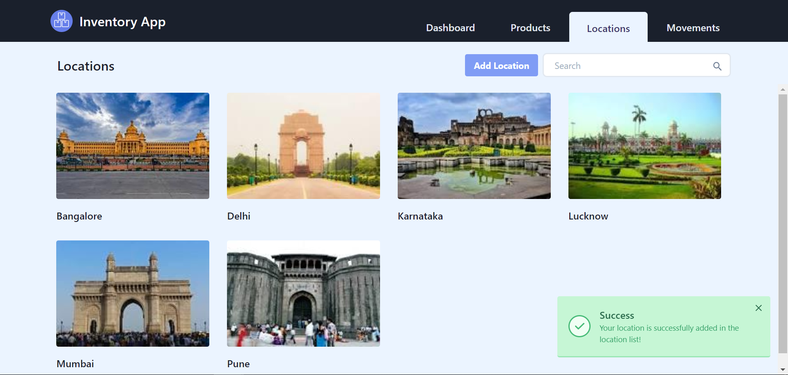
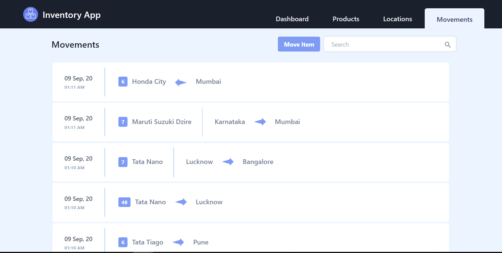
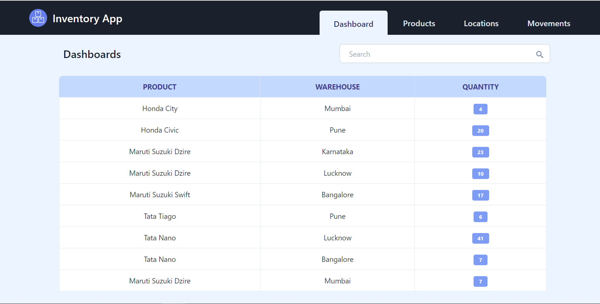

> Note: This application is only build for learning and demostration purpose.

# Flask Inventory App

An Inventory Management Web Application built with [Flask](http://flask.pocoo.org/) and [Tailwindcss](https://tailwindcss.com/) used to manage inventory of a list of products in respective warehouses. User can move product from one location to another, can only add product to location also can remove from the location.

I have deployed the app on heroku, go on https://heroku-inventory.herokuapp.com/ to check the app.

### Prerequisites

To run this system you will need :

- [Python 3](https://www.python.org/downloads/)


## Development Quickstart

To develop this project:

1.  Clone the repository:

    ```python
    $ git clone https://github.com/shariquerik/flask-inventory-app.git
    $ cd flask-inventory-app
    ```

2.  Create a virtual environment:

    ```python
    $ py -m venv env
    ```
    
3.  Activate virtual environemnt:

    *bash*
    
    ```sh
    source env/bin/activate
    ```

    
    *windows*
    ```ps
    $ env\Scripts\activate
    ```
    
4. Install Dependencies:

    ```python
    $ pip install -r requirements.txt
    ```
    
5. Run the application:

    ```python
    $ python run.py
    ```
    
6. Visit [http://localhost:5000/](http://localhost:5000/) from your browser to access the app.
    


## Screenshots:

Below are the screenshots of the views available in application. 

- ### Products:
This view shows list of products:



- ### Locations:
This view shows list of Warehouse Locations:



- ### Product Movements:
This view shows the history of product movements:



- ### Dashboard:
This reports shows the balance quantity in each location:

